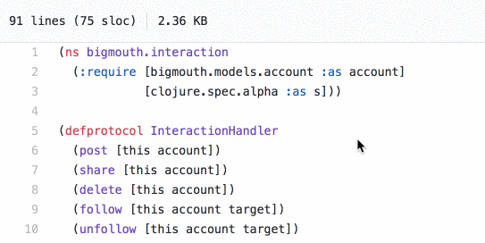

  <h1 align="center">clj-spec-view</h1>

 
  

 <strong>A chrome extension that provide views of function specs at your browser. (*currently only github*).</strong>
 

  <h3>
    <a href="https://chrome.google.com/webstore/detail/clj-spec-view/ohdilhfeehobpbnioeghljglgjbpjkin">
      Download
    </a>
     | 
    <a href="https://github.com/pfeodrippe/clj-spec-view/issues?q=is%3Aissue+is%3Aopen+label%3A%22help+wanted%22">
      Contribute
    </a>
  </h3>

## How it works

Just place the cursor over a specified function and see its spec. 

You can see some fspec examples at [Bigmouth repo](https://github.com/athos/Bigmouth/blob/master/src/bigmouth/interaction.clj).

### Github Access Token (for rate limits or private repos)

[Create one](https://help.github.com/articles/creating-an-access-token-for-command-line-use) and access it from the extension popup button (at your toolbar).

## TODO

- Add icon at code
- Search at actual branch
- Find clojure.alpha.spec alias (now it shows any `fdef` definition)
- Open file of current spec
- Add contribute guide

## Thanks

To all the contributors and the awesome [Chromex](https://github.com/binaryage/chromex) library.
